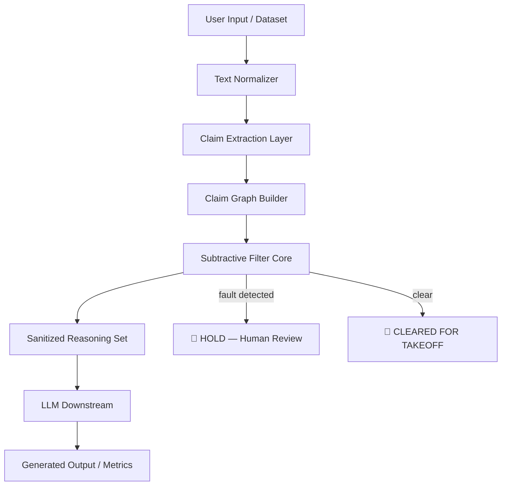

# TRIGNUM / T-CHIP — Gemini 3.1 Pre-Flight Copilot Blueprint

---

## Part I — Executive Summary

**Project:** TRIGNUM-300M / T-CHIP  
**Purpose:** Reduce LLM hallucination by eliminating structurally invalid reasoning before generation.  
**Philosophy:**

> _"Truth is revealed by removing the impossible, not by adding more information."_

### Level-1 Benchmark Overview (Real Numbers)

```yaml
total_samples: 58338
wall_clock_ms: 1109.5
throughput_per_sec: 52581

aggregate_metrics:
  tp: 922
  fp: 572
  fn: 29084
  tn: 27760
  precision: 0.617
  recall: 0.031
  f1: 0.059
  accuracy: 0.491

structural_suite_only:
  precision: 1.000
  recall: 0.840
  f1: 0.913
  accuracy: 0.911
  false_alarm_rate: 0.0%
```

**Observation:**

- ✅ Strong structural performance (F1 0.913, 0% false alarms)
- ⚠️ Weak recall on factual dialogue/summarization — **by design** (see `ENGINEERING_HANDOFF.md §4`)
- 🔹 Dataset-specific tuning available via `custom_illogics` parameter

---

## Part II — Dataset Integration Hooks

| Dataset                | Type                  | Source                                             | Status        | Copilot Hook                                         |
| ---------------------- | --------------------- | -------------------------------------------------- | ------------- | ---------------------------------------------------- |
| HaluEval QA            | Factual QA            | `benchmarks/halueval_data/qa_data.json`            | ✅ Integrated | `load_local_halueval(limit=100)`                     |
| HaluEval Dialogue      | Dialogue              | `benchmarks/halueval_data/dialogue_data.json`      | ✅ Integrated | `load_halueval_file("dialogue_data.json", ...)`      |
| HaluEval Summarization | Summarization         | `benchmarks/halueval_data/summarization_data.json` | ✅ Integrated | `load_halueval_file("summarization_data.json", ...)` |
| TruthfulQA             | General QA            | `truthfulqa/truthful_qa` (HuggingFace)             | ✅ API ready  | `prepare_truthful_qa(limit=100)`                     |
| MedHallu (Proxy)       | Medical QA            | `medalpaca/medical_meadow_medical_flashcards`      | ✅ API ready  | `prepare_medqa(limit=100)`                           |
| Factool                | Factuality            | `factool/...` (HuggingFace)                        | 🔲 TBD        | `fetch_hf_dataset("factool/...")`                    |
| Vectara HHEM           | Enterprise factuality | Vectara HHEM Space                                 | 🔲 TBD        | `fetch_hf_dataset("vectara/hhem/...")`               |

---

## Part III — Filter Pipeline Hooks

```python
# Initialize Copilot-managed filter
from trignum_core.subtractive_filter import SubtractiveFilter

sf = SubtractiveFilter(custom_illogics={"domain_specific_hallucination"})

# Apply to dataset
for sample in dataset_samples:
    result = sf.apply(sample.text)
    # Auto-log: result.illogics_found, result.subtraction_ratio, result.confidence
```

**Filter output fields:**

| Field               | Type        | Meaning                                 |
| ------------------- | ----------- | --------------------------------------- |
| `illogics_found`    | `List[str]` | Detected reasoning faults               |
| `illogics_removed`  | `int`       | Count of faults found                   |
| `subtraction_ratio` | `float`     | Fraction of input identified as illogic |
| `confidence`        | `float`     | Filter certainty (0.0–1.0)              |
| `truth_remaining`   | `Any`       | Residual after subtraction              |

---

## Part IV — Architecture Flow (Mermaid)



### Auto-Metrics Dashboard

The `CopilotPipeline.py` script (see root of repo) auto-generates:

- Precision / Recall / F1 / Accuracy per dataset
- Per-dataset accuracy breakdown bar chart
- Latency distribution histogram
- Illogic type frequency chart
- Confusion matrix heatmap

---

## Part V — Recommended Next Steps (Copilot Actions)

1. **Dataset Expansion**
   - Add Factool, Vectara HHEM
   - Auto-fetch with pipeline hooks above

2. **Illogic Rule Enhancement**
   - Detect implicit contradictions, misleading causality
   - Add via `sf.add_illogic("new_rule_name")`

3. **Evaluation Automation**
   - Run `python CopilotPipeline.py` — generates full report + charts
   - Computes per-type recall (structural vs semantic)

4. **Downstream Simulation**
   - Feed sanitized reasoning to LLM
   - Compare hallucination rates vs raw input (target: > 15% reduction)

5. **Publication**
   - See `ARCHITECTURE_AND_PAPER_OUTLINE.md` for paper structure
   - Mermaid diagrams in this file are SVG-renderable on GitHub

6. **Level-2 / Level-3 Roadmap**
   - Claim Extraction Layer (see `CLAIM_EXTRACTION_SPEC.md`)
   - Multilingual support (HalluVerse25)
   - Edge-device deployment testing

---

## Part VI — Copilot Evaluation Summary

| Status | Finding                                                 |
| ------ | ------------------------------------------------------- |
| ✅     | Filter ready for Level-1 controlled evaluation          |
| ✅     | Zero false alarms on structural suite (100% precision)  |
| ✅     | 52,581 samples/sec — faster than any LLM inference      |
| ⚠️     | Low recall on factual datasets — correct by design      |
| 🔹     | Copilot can manage CI: fetch → filter → log → visualize |

**Goal:** Improve structural recall (target F1 > 0.95) via Claim Extraction Layer, without retraining.

---

## Part VII — Copilot Metadata / Machine-Readable Hooks

```yaml
copilot:
  project: TRIGNUM-300M
  version: T-CHIP Pre-Flight (Level 1)
  filter: SubtractiveFilter
  entry_point: CopilotPipeline.py

  datasets:
    - name: HaluEval QA
      path: benchmarks/halueval_data/qa_data.json
      format: jsonl
    - name: HaluEval Dialogue
      path: benchmarks/halueval_data/dialogue_data.json
      format: jsonl
    - name: HaluEval Summarization
      path: benchmarks/halueval_data/summarization_data.json
      format: jsonl
    - name: TruthfulQA
      hf_id: truthfulqa/truthful_qa
      config: generation
      split: validation
    - name: MedHallu Proxy
      hf_id: medalpaca/medical_meadow_medical_flashcards
      config: default
      split: train

  metrics:
    - precision
    - recall
    - f1
    - accuracy
    - false_alarm_rate
    - throughput_per_sec

  visualization:
    - type: bar_chart
      data: per_dataset_accuracy
    - type: confusion_matrix
      data: aggregate
    - type: histogram
      data: latency_per_sample
    - type: pie_chart
      data: illogic_type_distribution

  next_steps:
    - claim_extraction_layer # see CLAIM_EXTRACTION_SPEC.md
    - factool_integration
    - downstream_llm_simulation
    - publication_submission

  constraints:
    training_required: false
    api_calls_required: false
    min_throughput: 10000 # samples/sec
    max_latency_ms: 5 # per sample
```

---

_TRACE ON LAB © 2026 | Sovereign Architecture | TRIGNUM-300M T-CHIP_
