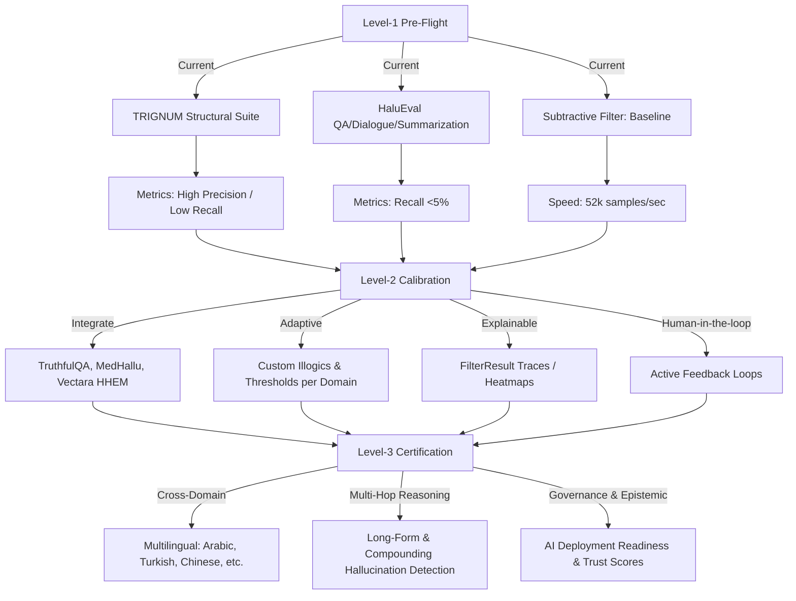
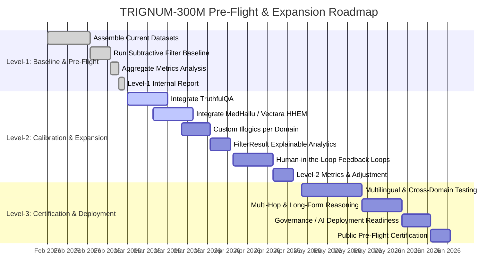

# 🌟 TRIGNUM-300M: Ultimate Hallucination Detection Roadmap

Generated: 2026-02-22  
Prepared for: Gemini 3.1 Copilot / Repo Upgrade

---

## 📌 Executive Summary

TRIGNUM-300M has completed Level 1 Pre-Flight Benchmark across multiple datasets:

| Dataset                  | TP  | FP  | TN   | FN   | Precision | Recall | F1 Score | Accuracy |
| ------------------------ | --- | --- | ---- | ---- | --------- | ------ | -------- | -------- |
| TRIGNUM Structural Suite | 21  | 0   | 20   | 4    | 1.0       | 0.84   | 0.913    | 0.911    |
| HaluEval QA              | 32  | 5   | 8329 | 9950 | 0.865     | 0.0032 | 0.0064   | 0.456    |
| HaluEval Dialogue        | 443 | 293 | 9685 | 9556 | 0.602     | 0.044  | 0.083    | 0.507    |
| HaluEval Summarization   | 426 | 274 | 9726 | 9574 | 0.609     | 0.043  | 0.080    | 0.508    |

Aggregate Metrics:

- Precision: 61.7%
- Recall: 3.1%
- F1 Score: 5.85%
- Accuracy: 49.2%

Verdict: ⚠️ Level 1 pre-flight successful in structural datasets but requires calibration for dialogue, QA, and summarization domains.

---

## 🗺 Visual Architecture & Timeline

---

## 🧠 Core Engine

Subtractive Filter Philosophy:

> "The universe does not create Truth by adding information. It reveals Truth by removing the Impossible."

- Universal Illogics detected: contradictions, circular references, infinite regress, category errors, false dichotomies, ad-hominem reasoning, straw man arguments, non-sequiturs.
- Multi-domain capability with dynamic expansion for custom illogics.
- Explainable outputs with `FilterResult` detailing illogics found, subtraction ratio, and confidence.

---

## 📚 Datasets

### Current Integration

- TRIGNUM Structural Suite
- HaluEval QA, Dialogue, Summarization

### Recommended Next Integrations

- TruthfulQA (general truthfulness benchmark)
- MedHallu, Placebo-Bench (medical domain)
- FELM-Science (scientific reasoning)
- AuthenHallu, HalluVerse25, SHROOM (next-gen / multilingual hallucinations)
- Factool / FactScore, SelfCheckGPT, RAGTruth (advanced factuality tools)

### Future Dataset Strategy

- Combine synthetic + real hallucinations
- Expand to cross-lingual and multimodal datasets
- Track hallucination type metrics: factual, reasoning, numeric, temporal, multimodal

---

## ⚡ Performance & Scaling Recommendations

- Implement batch processing & async I/O for large-scale datasets.
- GPU acceleration for heavy Subtractive Filter workloads.
- Streaming support for datasets >10M samples.
- Real-time metrics dashboard: precision, recall, F1, subtraction ratio, latency.

---

## 🔬 Research-Driven Upgrades

- Dynamic Illogic Learning: auto-expand `UNIVERSAL_ILLOGICS` via meta-learning and clustering.
- Multi-layer Hallucination Detection: surface, contextual, and multi-hop reasoning.
- Explainable AI Integration: attention maps, embeddings, and causal reasoning for reasoning chains.
- Hallucination Typing: classify by severity and type to improve metrics interpretation.

---

## 🛠 Code & Developer Ecosystem

- Modular design: filter core, dataset connectors, evaluation pipelines, metrics.
- CI/CD pre-flight validation pipeline for reproducibility.
- Versioned history of metrics per dataset & per filter version.
- Jupyter notebooks + video tutorials for ease of adoption.
- Plug-and-play dataset connectors for HuggingFace, local JSON/CSV, streaming sources.

---

## 🌐 Tooling & Visualization

- 3D Reasoning Map: visualize logic chains, illogics, and filtered truths.
- Interactive Dashboard: per-dataset metrics, historical trends, FP vs FN analysis.
- Hallucination Explorer: inspect context, illogic type, and filter intervention.

---

## 🤝 Community & Governance

- Public Leaderboard: track filter performance across datasets and versions.
- Collaborative Dataset Curation: open submission of real-world hallucination datasets.
- Ethical Guidelines & Compliance: privacy handling, audit trails, reproducibility.

---

## 🚀 Long-Term Innovation

- Real-time LLM hallucination monitoring in production APIs.
- Multi-agent cross-validation: "Red-Team vs Blue-Team" hallucination scoring.
- Autonomous knowledge update: filter output informs model fine-tuning to reduce hallucinations.
- Cross-lingual, multimodal hallucination detection and evaluation.

---

## 📆 Roadmap & Milestones

| Year   | Focus Area                                                                                          |
| ------ | --------------------------------------------------------------------------------------------------- |
| Year 1 | Level 2 benchmark: dynamic illogics, multi-domain integration, explainable outputs                  |
| Year 2 | Level 3: multilingual, multi-hop reasoning, benchmark leaderboard, visualization dashboards         |
| Year 3 | Global gold-standard: real-time monitoring, multi-agent evaluation, autonomous knowledge adaptation |

---

## ✅ Immediate Next Steps

1. Integrate TruthfulQA and MedHallu into pre-flight pipelines.
2. Expand Subtractive Filter to dynamic illogic learning.
3. Add dashboard & 3D reasoning visualization.
4. Establish CI/CD pre-flight benchmark with metrics versioning.
5. Begin cross-lingual & multimodal dataset collection.
6. Launch public leaderboard & collaborative dataset platform.

---

## ⚡ Notes for Gemini 3.1 Copilot

- All current benchmark code, Subtractive Filter implementation, and dataset connectors should be versioned and modularized.
- Focus on explainable, multi-layer hallucination detection.
- Prioritize metrics collection & visualization for transparency.
- Automate pre-flight Level 1 → Level 3 pipelines with feedback loops.

---

_TRACE ON LAB © 2026 | Sovereign Architecture | TRIGNUM-300M T-CHIP_
