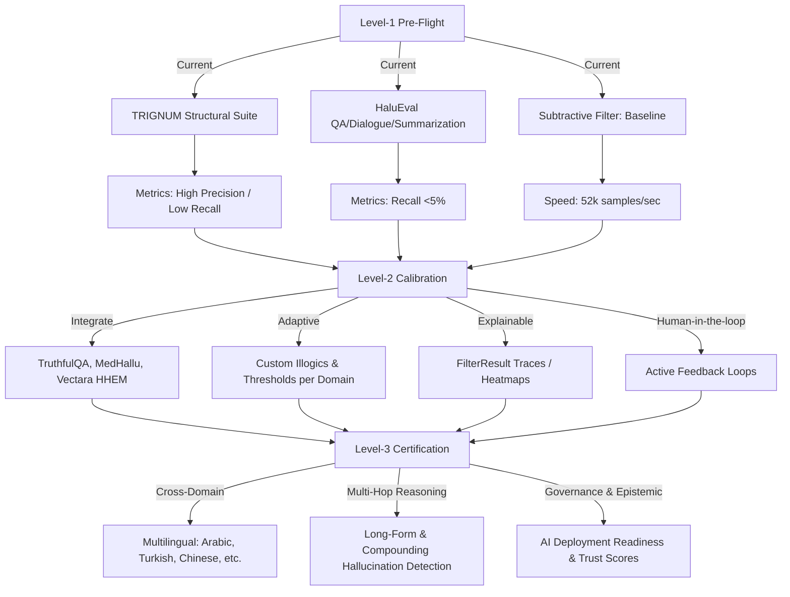

# 🗺 TRIGNUM-300M Hallucination Detection Roadmap

**📝 Key Notes for the Diagram:**

- **Level-1**: Current state, baseline evaluation, small structured datasets, Subtractive Filter working.
- **Level-2**: Expand datasets, integrate adaptive thresholds, introduce explainable analytics, human-in-the-loop feedback.
- **Level-3**: Cross-domain generalization, long-form & multi-hop reasoning detection, multilingual support, pre-flight certification for safe deployment.

---

A structured roadmap for future TRIGNUM evolution, broken down into "Copilot-ready" tracks. Each represents a concrete action or research track to expand hallucination detection and overall AI epistemic reliability.

## 6️⃣ Strategic Roadmap (Bullet-Proof Titles)

1. **Level-3 Benchmark Expansion** — Integrate next-gen datasets, fine-grained hallucinations.
2. **Automated SubtractiveFilter Calibration** — Domain-specific thresholds & adaptive confidence.
3. **Real-Time Multi-Domain Evaluation** — Continuous monitoring, RAG support.
4. **Explainable Hallucination Analytics** — Traces, visual causal maps, heatmaps.
5. **Active Learning & Human-in-the-Loop** — Curated feedback & semi-supervised learning.
6. **Epistemic Benchmarking & Certification** — Pre-flight readiness, trust scores.
7. **Cross-Language & Cultural Expansion** — Multilingual & culturally grounded reasoning.
8. **Long-Form & Multi-Hop Reasoning Checks** — Track compounding hallucinations.
9. **Integration with AI Governance Tools** — Enterprise dashboards, compliance reporting.
10. **Predictive Hallucination Modeling** — Preemptive warnings & token-level analysis.

---

## 7️⃣ Final Recommendation

> 🟡 **Caution — Level-2 Pre-Flight Status**

- TRIGNUM-300M is ready for small structured tests, but not yet reliable for multi-domain deployment.
- Focus on recall improvement, dataset integration, and human-in-the-loop feedback before wider rollout.
- Parallel effort: build visualization & traceability tools to provide explainable hallucination alerts.

Once these steps are implemented, TRIGNUM can achieve Level-3 certification with strong generalization and robust multi-domain hallucination detection.

---

_TRACE ON LAB © 2026 | Sovereign Architecture | TRIGNUM-300M T-CHIP_
