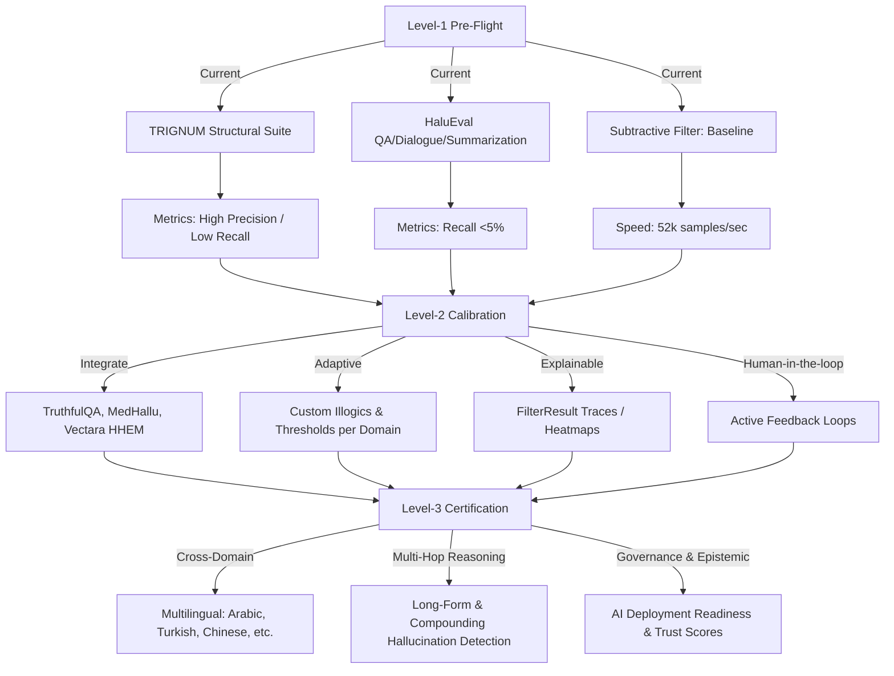
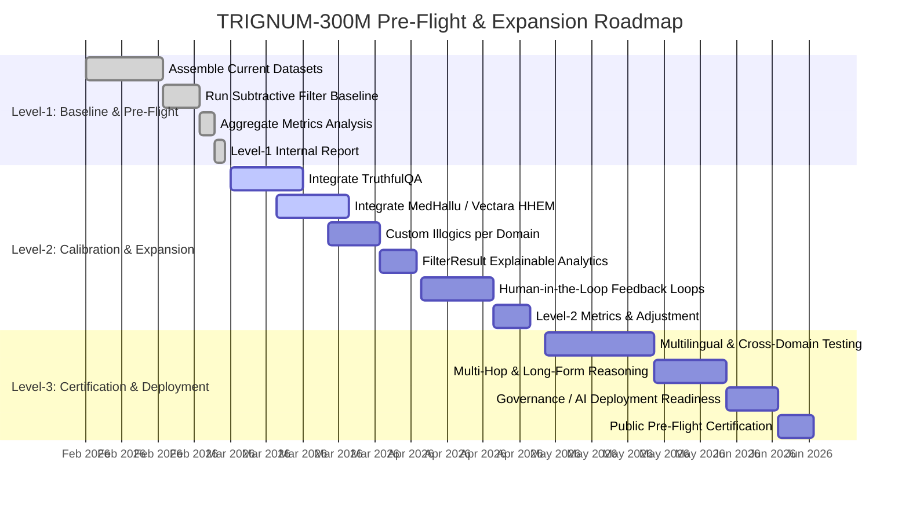

# 🗺 TRIGNUM-300M Hallucination Detection Roadmap

**📝 Key Notes for the Diagram:**

- **Level-1**: Current state, baseline evaluation, small structured datasets, Subtractive Filter working.
- **Level-2**: Expand datasets, integrate adaptive thresholds, introduce explainable analytics, human-in-the-loop feedback.
- **Level-3**: Cross-domain generalization, long-form & multi-hop reasoning detection, multilingual support, pre-flight certification for safe deployment.

---

## ⏱ TRIGNUM-300M Pre-Flight & Expansion Timeline

**🔹 Key Recommendations:**

- **Level-1**: Finalize pre-flight metrics (already done: high precision, low recall) and archive baseline.
- **Level-2**: Expand evaluation with TruthfulQA, MedHallu, Vectara HHEM, implement adaptive thresholds, explainable outputs, and human feedback.
- **Level-3**: Test cross-domain generalization, multilingual capability, multi-hop reasoning, and formal governance readiness.
- **Future Research**: Explore fine-grained hallucination categories, dynamic illogic learning, and real-time LLM monitoring for operational deployment.

---

## 🌟 TRIGNUM-300M Next-Level Upgrade Blueprint

### 1. Architecture & Core Engine Upgrades

**Adaptive Subtractive Filter**

- Enable dynamic learning of new illogics from feedback.
- Auto-tune thresholds per dataset/domain.
- Multi-layer filter: text → structure → reasoning → knowledge graph.

**Hierarchical Hallucination Detection**

- **Level 1**: Surface illogics (contradiction, category errors).
- **Level 2**: Contextual hallucinations (misleading reasoning, overgeneralization).
- **Level 3**: Multi-hop hallucinations in reasoning chains.

**Explainable Outputs**

- Rich `FilterResult` with reasoning path, confidence, illogic severity.
- Graph visualization of logical chains and removed illogics.

### 2. Dataset Expansion

**Integrate More Public Benchmarks**

- TruthfulQA (already planned), MedHallu, Vectara HHEM.
- FELM-Science, Placebo-Bench, AuthenHallu, SHROOM (SemEval 2024), HalluVerse25.

**Synthetic + Real Mix**

- Auto-generate adversarial hallucinations with GPT-5-like models.
- Include real human-LM interaction logs for authentic hallucinations.

**Cross-Lingual & Multimodal**

- Arabic, Turkish, Spanish, Mandarin.
- Text + images (vision-language models) hallucination detection.

### 3. Performance & Scalability

**Batch & Async Processing**

- Use async I/O for HuggingFace fetches and evaluation.
- Parallel Subtractive Filter runs with GPU acceleration.

**Large Dataset Handling**

- Support datasets >10M samples with streaming & memory-mapped storage.

**Profiling & Metrics Dashboard**

- Real-time metrics: precision, recall, F1, subtraction ratio, latency.
- Compare across datasets and versions.

### 4. Research-Driven Upgrades

**Dynamic Illogic Learning**

- Use meta-learning to expand `UNIVERSAL_ILLOGICS`.
- Cluster hallucinations by semantic pattern & update filter dynamically.

**Fine-Grained Hallucination Typing**

- Label hallucinations: factual, reasoning, numeric, temporal, multimodal.
- Report per-type metrics.

**Explainable AI Integration**

- Combine with attention maps, embeddings, and causal reasoning analysis.

### 5. Code & Developer Ecosystem

**Modular Library**

- Split: filter core, dataset connectors, evaluation pipelines, metrics.

**Plug-and-Play Dataset Connectors**

- HuggingFace API, local JSON/CSV, streaming sources.

**CI/CD & Pre-Flight Validation**

- Auto-run pre-flight benchmark before each major commit.
- Store history with versioned metrics for reproducibility.

**Comprehensive Docs & Tutorials**

- Jupyter notebooks + markdown guides.
- Video walkthroughs for integration and evaluation.

### 6. Tooling & Visualization

**3D Reasoning Map**

- Map illogics and filtered truths as 3D graphs (nodes = statements, edges = logic paths).

**Dashboard**

- Plot: per-dataset metrics, historical trends, false-positive vs false-negative analysis.

**Hallucination Explorer**

- Interactive tool to explore detected hallucinations, context, and filter action.

### 7. Community & Governance

**Open Benchmarks & Leaderboard**

- Public leaderboard to compare filter versions and models.

**Collaborative Dataset Curation**

- Invite researchers to submit real-world hallucination datasets.

**Governance & Compliance**

- Versioning for auditability.
- Dataset privacy handling.
- Ethical guidelines for hallucination detection.

### 8. Long-Term Research & Innovation

**Real-Time LLM Monitoring**

- Deploy filter on production LLM APIs for live hallucination scoring.

**Multi-Agent Cross-Validation**

- Agents fact-check each other to simulate "Red-Team vs Blue-Team" evaluation.

**Autonomous Knowledge Update**

- Feedback loop: filter output informs model fine-tuning for hallucination reduction.

---

## ✅ Milestones for the Next 3 Years

1. **Year 1 – Level 2**: Full multi-dataset integration, explainable outputs, dynamic illogics.
2. **Year 2 – Level 3**: Multilingual, multi-hop reasoning, benchmark leaderboards, advanced visualization.
3. **Year 3 – Global gold-standard**: Real-time monitoring, multi-agent cross-validation, autonomous knowledge adaptation.

---

## 🛑 Final Recommendation

> 🟡 **Caution — Level-2 Pre-Flight Status**
>
> - TRIGNUM-300M is ready for small structured tests, but not yet reliable for multi-domain deployment.
> - Focus on recall improvement, dataset integration, and human-in-the-loop feedback before wider rollout.
> - Parallel effort: build visualization & traceability tools to provide explainable hallucination alerts.
>
> Once these steps are implemented, TRIGNUM can achieve Level-3 certification with strong generalization and robust multi-domain hallucination detection.

---

_TRACE ON LAB © 2026 | Sovereign Architecture | TRIGNUM-300M T-CHIP_
